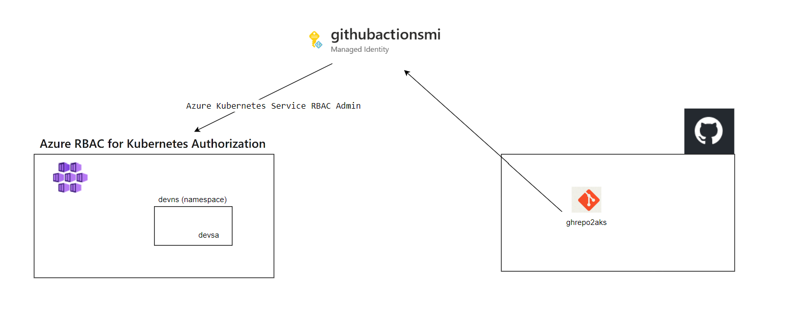
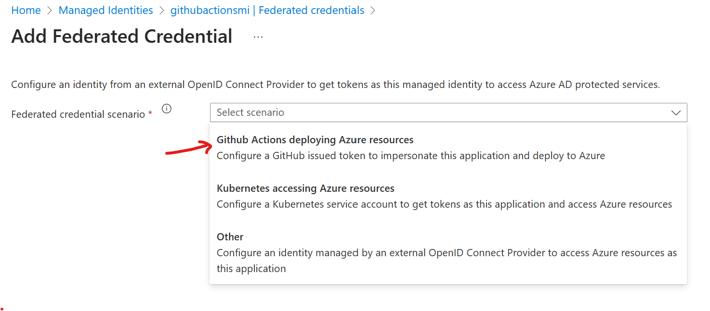
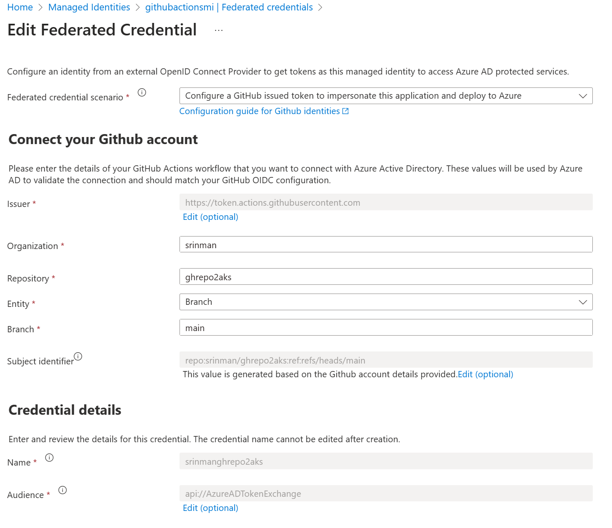

# Azure Kubernetes Service, Azure Active Directory Federated Credentials and Github Actions

This demonstrates how to leverage federated identity credential with user-assigned managed identity to deploy K8S workload into AKS cluster with Azure RBAC for Kubernetes Authorization.  

This method solves a couple of challenges:   
-  Federated credentials to access Azure resources.  OIDC allows GitHub Actions workflows to access resources in Azure, without needing to store the Azure credentials as long-lived GitHub secrets.    
-  Leverags Azure RBAC for Kubernetese to deploy Kubernetes application directly into AKS cluster. AKS is an Azure resource and Azure roles such as "Azure Kubernetes Service RBAC Writer" has been assigned to managed identity. 

It's mapping of  Managed Identity to GitHub Org+Repo+Branch where GitHub Actions workflow live.  



It's important to note that this does not require any administrator to login to AKS/K8S to setup any roles as it's taken care of by Azure RBAC for K8S auth layer. In few steps,  you establish a continuous deploy pipeline from Github without exchanging/sending/storing any secrets to deploy workload into your AKS cluster without any secrets laying around!


https://learn.microsoft.com/en-us/azure/active-directory/workload-identities/workload-identity-federation-create-trust-user-assigned-managed-identity?pivots=identity-wif-mi-methods-azp


https://learn.microsoft.com/en-us/azure/active-directory/workload-identities/workload-identity-federation


An excerpt from the links above

>*You use workload identity federation to configure an Azure AD app registration or user-assigned managed identity to trust tokens from an external identity provider (IdP), such as GitHub. Once that trust relationship is created, your software workload can exchange trusted tokens from the external IdP for access tokens from Microsoft identity platform. Your software workload then uses that access token to access the Azure AD protected resources to which the workload has been granted access. This eliminates the maintenance burden of manually managing credentials and eliminates the risk of leaking secrets or having certificates expire.*


  
---

## Create a managed identity

Create user-assigned managed identity (UAMI) in a resource group where AKS resource is.  


## Configure trust between Managed Identity and GitHub Repo Branch

Review 'Federated credentials' under 'Settings' for this newly created UAMI.  

Add Credentials

For Scenario, choose 'Github Actions deploying Azure resources'  (use screen snapshot as a reference)






## Populate UAMI information in GitHub Actions Secrets  
Follow instructions to create 'Github Action' secrets (link below).  This is only for AZURE_CLIENT_ID, AZURE_TENANT_ID, AZURE_SUBSCRIPTION_ID (client secret not needed nor generated).  
You can get this from Managed Identity Overview section or with CLI.  
https://learn.microsoft.com/en-us/azure/developer/github/connect-from-azure?tabs=azure-portal%2Clinux#create-github-secrets

With the information from this link above and from this workflow in this repo, it's ready for deploying application to any AKS cluster for which UAMI has access to.

## Managed identity access to deploy workload into AKS

Create a AKS cluster  

Enable 'Azure AD authentication with Azure RBAC'  

Let's assign RBAC Writer role scoped to devns and prodns namespaces only (commands below).   

It is assumed that your administrator has created namespaces. In this case, you need to give yourself admin access and create the prodns and devns namespaces.  In a typical scenario, AKS platform administrators would create namespaces and establish roles. The creation of roles might be done by either the security team or the platform team, and it depends on the situation.
```
az role assignment create --role "Azure Kubernetes Service Cluster User Role" --assignee "OBJECTIDOFUAMIGOESHERE" --scope /subscriptions/SUBSCRIPTIONIDGOESHERE/resourcegroups/aksgithubrg/providers/Microsoft.ContainerService/managedClusters/aksgithub

az role assignment create --role "Azure Kubernetes Service RBAC Writer" --assignee "OBJECTIDOFUAMIGOESHERE" --scope /subscriptions/SUBSCRIPTIONIDGOESHERE/resourcegroups/aksgithubrg/providers/Microsoft.ContainerService/managedClusters/aksgithub/namespaces/prodns

az role assignment create --role "Azure Kubernetes Service RBAC Writer" --assignee "OBJECTIDOFUAMIGOESHERE" --scope /subscriptions/SUBSCRIPTIONIDGOESHERE/resourcegroups/aksgithubrg/providers/Microsoft.ContainerService/managedClusters/aksgithub/namespaces/devns
```


## Deploy workload 

base folder has basic nginx deployment with namespace and service creation. 
overlay folder has dev and prod. 


---
You are free to modify this based on your application deployment needs. The purpose of this demonstration is to show how easy it is to deploy or update an app with GitHub Actions and AKS, thanks to the recently supported features such as Federated managed credentials.


